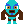
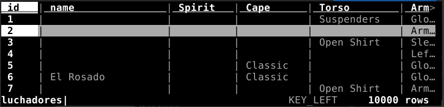
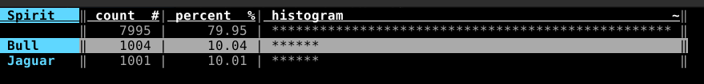
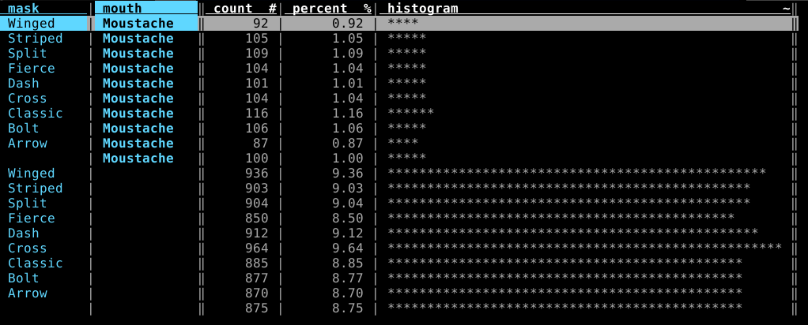
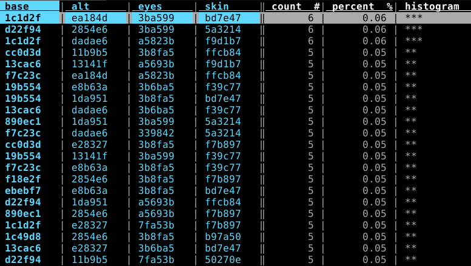
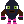
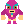

# LuchaData

## Purpose
Get [luchadores.io](https://luchadores.io/) data.
Thanks to them for their awesome project.



## Requirements
* Python3
Optional, required for onchain data only:
* Web3.py
* An Infura API key (or another Web3 provider). `export WEB3_INFURA_PROJECT_ID=1234abcd...`

Tested on Linux.

## Usage
```
usage: get_luchador_info.py [-h] [-d OUTPUT_DIR] [-i DNA_FILE] [-r] [-o CSV_FILE] [-n] [-w] [ids [ids ...]]

Display Luchadores infos

positional arguments:
  ids            List of Luchadores Id (defalut: get them all)

optional arguments:
  -h, --help     show this help message and exit
  -d OUTPUT_DIR  generate svg images and save it in folder
  -i DNA_FILE    get id,adn from an ordered csv file (default lucha_id_to_dna.csv)
  -r             use with '-d'. Saves svg file in an human readable format (parsed and indented by xml lib
  -o CSV_FILE    saves data into a file
  -n             get names onchain (requires WEB3_INFURA_PROJECT_ID exported)
  -w             display owner (requires WEB3_INFURA_PROJECT_ID)
```

## Quickstart
Download the project and open a terminal in src `cd src`
All the data needed is in src, except the data that may change ie the Lucha's name and its owner.  
So `-n` and `-w` arguments needs a `WEB3_INFURA_PROJECT_ID` env var and an internet connexion.

### Offline usage
Get stats for Luchadores 6 88 999 10000:
```
./get_luchador_info.py 6 88 999 10000
Name          : attrs count (owner and/or name if asked)
spirit      cape        torso       arms        mask        mouth       bottoms     boots       
      Color codes ...
--------------------------------------------------------------------------------------------
--- Luchador #6    --- 3 attrs --  -------- 
-           Classic     -           Gloves      Classic     -           -           -           
            base: #d22f94   alt: #e0369f  eyes: #7fa53b  skin: #50270e
--- Luchador #88   --- 2 attrs --  -------- 
Jaguar      -           -           -           -           -           -           Two Tone    
            base: #1c49d8   alt: #1da951  eyes: #4e2906  skin: #bd7e47
--- Luchador #999  --- 5 attrs --  -------- 
Bull        Hooded      Shirt       -           Split       -           Tights      -           
            base: #d22f94   alt: #1da951  eyes: #844f1d  skin: #b97a50
--- Luchador #10000 --- 3 attrs --  -------- 
-           -           -           Left Band   Bolt        -           Tights      -           
            base: #d22f94   alt: #9511d2  eyes: #844f1d  skin: #3a1b09
```
For all Luchadores, just ` ./get_luchador_info.py`  

Export a proper csv containing all specificities:
```
./get_luchador_info.py -o output.csv
```
Format: `id,owner,name,spirit,cape,torso,arms,mask,mouth,bottoms,boots,base,alt,eyes,skin`

Last but not least, __generate the svg__ (image) file for Luchador 7509 (which is __exactly__ `ImageData` stored onchain) in /tmp:
```
./get_luchador_info.py -d /tmp 7509
```
Use the above command with `-r` to get an human readable format, parsed and indented.

### Onchain data
Once again, only Infura is supported, you must have an (free) [account](https://infura.io/), create a key and `export WEB3_INFURA_PROJECT_ID=put_here_your_key`. You can now get the current owner and the Lucha's name if any.

Extract all the available data to generate an up-to-date luchadores.csv as you'll find in this present repository : `./get_luchador_info.py -o ../luchadores.csv -wn`

### Use it with VisiData
If the `-o file.csv` flag is used (in both tools), we can explore the output with [VisiData](https://www.visidata.org/) `vd file.csv`.
Quick intro :
- arrows to navigate in the columns
- sort: `[` or `]`
- search in column: `/`
- frequency table: `F`
- back/quit: `q`
- [doc](https://jsvine.github.io/intro-to-visidata/the-big-picture/visidata-in-60-seconds/)
 
  

  


## Scripts
* `get_luchador_info.py` prints, creates a .csv with all the data
* `get_dna_onchain.py` builds lucha_id_to_dna.csv from the onchain event `GenerateLuchador`. You'll have no need as the file is provided in ./src, and immutable yet since all 10,000 Lucha are minted.
* `get_luchadores_onchain.py` autonomous and gets data onchain. Slow since it makes many onchain queries, it is a POC, my first script.  

## Lucha as Python Class
Quick usage in an example:
```
# grep ^4502 lucha_id_to_dna.csv
4502,112731563430001163118055697731982720898584865859565956762167415918705040670684
# # Only the 12 last are useful ---------------------------------------^^^^^^^^^^^^
Python 3.8.10 (default, Jun  2 2021, 10:49:15) 
[GCC 9.4.0] on linux
Type "help", "copyright", "credits" or "license" for more information.
>>> from luchadores import Lucha
>>> dna=705040670684
>>> lucha = Lucha(lucha_id=4502, dna=dna)
>>> print(lucha)
Luchador4502 Colors(ebebf7/2854e6 eyes: 3b6ba5 skin: 5a3214) Attrs: OrderedDict([('spirit', None), ('cape', None), ('torso', None), ('arms', 'Gloves'), ('mask', 'Arrow'), ('mouth', None), ('bottoms', 'Tights'), ('boots', None)])
>>> lucha.to
lucha.to_svg(       lucha.totalSupply(  
>>> lucha.to_svg()
"<svg id='luchador4502'[...]
```
<svg id='luchador4502' width="120" xmlns='http://www.w3.org/2000/svg' viewBox='0 0 24 24'><style>#luchador4502 .lucha-base { fill: #ebebf7; } #luchador4502 .lucha-alt { fill: #2854e6; } #luchador4502 .lucha-eyes { fill: #3b6ba5; } #luchador4502 .lucha-skin { fill: #5a3214; } #luchador4502 .lucha-breathe { animation: 0.5s lucha-breathe infinite alternate ease-in-out; } @keyframes lucha-breathe { from { transform: translateY(0px); } to { transform: translateY(1%); } }</style><g class='lucha-breathe'><path class='lucha-skin' d='M22 12v-1h-1v-1h-1V9h-1V5h-1V3h-1V2h-1V1h-1V0H9v1H8v1H7v1H6v2H5v4H4v1H3v1H2v1H1v8h4v-1h1v-2H5v-3h1v1h1v1h1v2h8v-2h1v-1h1v-1h1v3h-1v2h1v1h4v-8z'/><path class='lucha-base' d='M5 16H1v3h4v-1h1v-1H5zM22 16h-3v1h-1v1h1v1h4v-3z'/><path class='lucha-alt' d='M3 16H1v1h4v-1H4zM22 16h-3v1h4v-1z'/><path class='lucha-base' d='M18 5V3h-1V2h-1V1h-1V0H9v1H8v1H7v1H6v2H5v5h1v2h1v1h1v1h1v1h6v-1h1v-1h1v-1h1v-2h1V5z'/><g class='lucha-alt'><path d='M18 5V3h-1V2h-1V1h-1V0H9v1H8v1H7v1H6v2H5v5h1v2h1v1h1v1h1v1h1v-4h1V5H9V3h1V2h1V1h2v1h1v1h1v2h-2v6h1v4h1v-1h1v-1h1v-1h1v-2h1V5z'/></g><path fill='#FFF' d='M9 6H6v3h4V6zM17 6h-3v3h4V6z'/><path class='lucha-eyes' d='M16 6h-2v3h3V6zM8 6H7v3h3V6H9z'/><path fill='#FFF' d='M7 6h1v1H7zM16 6h1v1h-1z' opacity='.4'/><path fill='#000' d='M15 7h1v1h-1zM8 7h1v1H8z'/><path class='lucha-skin' d='M14 10H9v3h6v-3z'/><path fill='#000' opacity='.9' d='M13 11h-3v1h4v-1z'/></g><path class='lucha-skin' d='M16 23v-6H8v6H7v1h4v-4h2v4h4v-1z'/><path class='lucha-base' d='M15 17H8v1h1v1h2v1h2v-1h2v-1h1v-1z'/><path class='lucha-alt' d='M15 17H8v6h3v-3h2v3h3v-6z'/><path class='lucha-base' d='M9 21H8v2H7v1h4v-3h-1zM16 23v-2h-3v3h4v-1z'/></svg>

Many thanks to my support team!






