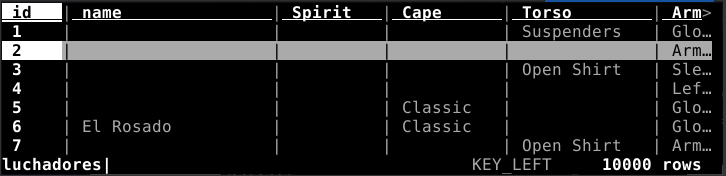
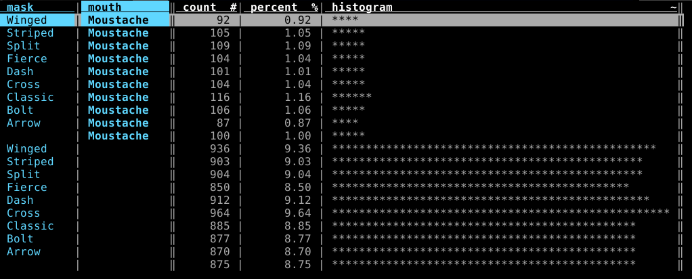
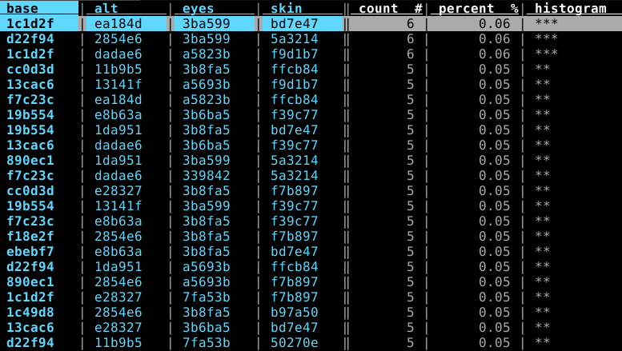

# LuchaData

## Purpose
Get onchain [luchadores.io](https://luchadores.io/) data.


## Requirements
* Python3
* Web3.py
* An Infura API key (or another Web3 provider). `export WEB3_INFURA_PROJECT_ID=1234abcd...`

Tested on Linux.

## Quickstart
`get_luchadores_onchain.py` is autonomous and gets data onchain.  
`get_dna_onchain.py` retrieves the dna onchain, in the events, and builds a simple database.csv which maps id and dna.  
`get_luchador_info.py` prints and creates a .csv with all the data.  

```
# ./get_luchadores_onchain.py -h                                       
usage: get_luchadores_onchain.py [-h] [-d OUTPUT_DIR] [-o CSV_FILE] [ids [ids ...]]

Query onchain Luchadores

positional arguments:
  ids            List of Luchadores Id (defalut: get them all)

optional arguments:
  -h, --help     show this help message and exit
  -d OUTPUT_DIR  extracts svg images in folder
  -o CSV_FILE    saves data into /path/file.csv

# ./get_luchador_info.py -h
usage: get_luchador_info.py [-h] [-i DNA_FILE] [-o CSV_FILE] [-n] [-w] [ids [ids ...]]

Display Luchadores infos

positional arguments:
  ids          List of Luchadores Id (defalut: get them all)

optional arguments:
  -h, --help   show this help message and exit
  -i DNA_FILE  get id,adn from an ordered csv file 'id, dna' (default lucha_id_to_dna.csv)
  -o CSV_FILE  saves data into a file
  -n           get names onchain (requires WEB3_INFURA_PROJECT_ID exported)
  -w           display owner (requires WEB3_INFURA_PROJECT_ID)

``` 

## Output
```
# ./get_luchadores_onchain.py 6 7509 
Luchador #6    : (3 attrs) owner: 0x147B8869655Bc09f226955cc676fF78efe240cA8  -~-~-===( El Rosado )===-~-~-
Spirit       Cape         Torso        Arms         Mask         Mouth        Bottoms      Boots       
 -           Classic       -           Gloves       Classic       -            -            -           
Luchador #7509 : (1 attrs) owner: 0x52434Cd9e4e4F965a20c8576841CbAAC4b2bA30e  
Spirit       Cape         Torso        Arms         Mask         Mouth        Bottoms      Boots       
 -            -            -            -           Fierce        -            -            -
```
```
# ./get_luchador_info.py -wn 6 10 100
Name          : attrs count (owner and/or name if asked)
spirit      cape        torso       arms        mask        mouth       bottoms     boots       
 Color codes ...
--------------------------------------------------------------------------------------------
Luchador #6    : 3 attrs 0x147B88..240cA8  	 -~-~-===( El Rosado  )===-~-~-
-           Classic     -           Gloves      Classic     -           -           -           
base: #d22f94   alt: #e0369f  eyes: #7fa53b  skin: #50270e
Luchador #10   : 3 attrs 0x789146..6c2340  	 -~-~-===(   )===-~-~-
-           -           Open Shirt  Left Band   Split       -           -           -           
base: #cc0d3d   alt: #13141f  eyes: #3ba577  skin: #f9d1b7
Luchador #100  : 2 attrs 0x378a63..eD1a3c  	 -~-~-===(   )===-~-~-
-           -           -           Gloves      Arrow       -           -           -           
base: #d22f94   alt: #e8b63a  eyes: #3ba577  skin: #5a3214

```

### Use it with VisiData
If the `-o file.csv` flag is used (in both tools), we can explore the output with [VisiData](https://www.visidata.org/) `vd file.csv`.
Quick intro :
- arrows to navigate in the columns
- sort: `[` or `]`
- search in column: `/`
- frequency table: `F`
- back/quit: `q`
- [doc](https://jsvine.github.io/intro-to-visidata/the-big-picture/visidata-in-60-seconds/)
 
  

  

### Embed a Lucha in a webpage
Extract the svg in a file:
```bash
./get_luchadores_onchain.py -o /tmp 7509
Luchador #7509 : (1 attrs) owner: 0x52434Cd9e4e4F965a20c8576841CbAAC4b2bA30e /tmp/luchador7509.svg 
Spirit       Cape         Torso        Arms         Mask         Mouth        Bottoms      Boots       
 -            -            -            -           Fierce        -            -            -
```

Then include it in a html file or embed it inline (here /tmp/luchador7509.svg).


